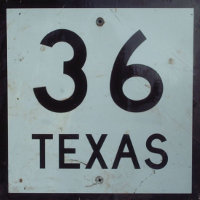

<p align="center">
    <a href="#36">
        
    </a>
</p>

# 36

[![][build-img]][build]
[![][nuget-img]][nuget]

[Base 10] to [base 36] and vice versa.

[build]:     https://ci.appveyor.com/project/TallesL/net-36
[build-img]: https://ci.appveyor.com/api/projects/status/github/tallesl/net-36?svg=true
[nuget]:     https://www.nuget.org/packages/36
[nuget-img]: https://badge.fury.io/nu/36.svg
[Base 10]:   https://en.wikipedia.org/wiki/Decimal
[base 36]:   https://en.wikipedia.org/wiki/Base36

## Usage

```cs
using Base36Library;

// Encoding
Base36.Encode(10);    // returns "A"
Base36.Encode(10000); // returns "7PS"

// Decoding
Base36.Decode("Z");   // returns 35L
Base36.Decode("10");  // returns 36L
Base36.Decode("7PS"); // returns 10000L

// Comparing
Base36.Compare("A", "A"); // 0
Base36.Compare("A", "Z"); // 1
Base36.Compare("Z", "A"); // -1

// Checking for overflow
Base36.WouldOverflow("BARRELROLL"); // False
Base36.WouldOverflow("DOABARRELROLL"); // True
```